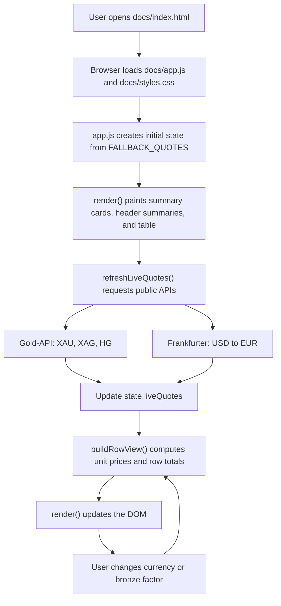
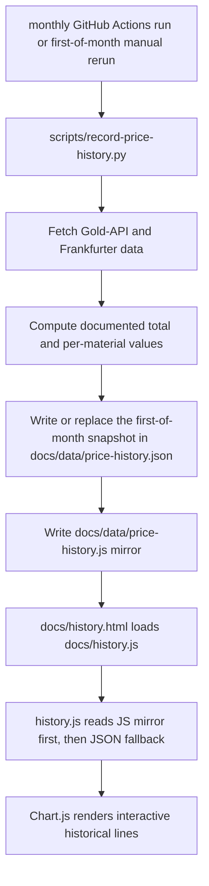

# Architecture

## High-level idea

The published site is a small client-side app. There is no backend. The browser loads static files from [`docs/`](docs/), fetches live prices from public APIs, combines those prices with the passage material dataset, and renders the table and totals into the page.

The repo now has two related published pages:

- [`docs/index.html`](docs/index.html): current calculator view
- [`docs/history.html`](docs/history.html): stored-history graph view

## File responsibilities

### [`docs/index.html`](docs/index.html)

`index.html` defines the structure of the page:

- the hero section and explanation copy
- the currency toggle
- the bronze-factor input
- the refresh button
- the summary cards
- the header-side live, update, and source summary text
- the empty table body that JavaScript fills at runtime

It does not contain the pricing logic. It mainly provides the DOM targets that `app.js` updates.

### [`docs/app.js`](docs/app.js)

`app.js` contains all runtime behavior:

1. It defines constants for biblical and unit conversions such as shekels, talents, kilograms, troy ounces, and pounds.
2. It defines `FALLBACK_QUOTES`, which are used when live requests are unavailable.
3. It defines `MATERIALS`, the core dataset for every row shown in the table, including rows quantified from earlier Exodus references when those references directly specify a named item's ingredients.
4. It keeps UI state in the `state` object:
   - selected currency
   - bronze estimate factor
   - current live quotes
   - live status message
5. It wires the UI controls:
   - clicking the USD/EUR buttons changes `state.currency`
   - editing the bronze factor changes `state.bronzeFactor`
   - clicking refresh calls `refreshLiveQuotes()`
6. It fetches live data in `refreshLiveQuotes()`:
   - gold from `XAU`
   - silver from `XAG`
   - copper from `HG`
   - USD/EUR from Frankfurter
7. It transforms each material row in `buildRowView()`:
   - resolves the current unit price
   - computes the row total when the amount is quantified
   - formats display text for the current currency
8. It redraws the whole table and summary values in `render()`.
9. It updates the header-side summary text so the page always shows the current live status, update timing, and source summary.

### [`docs/styles.css`](docs/styles.css)

`styles.css` is responsible for presentation only:

- page layout
- card styles
- table styling
- responsive behavior
- visual states for live, snapshot, and gap rows

It does not change the math or the data model.

### [`docs/history.html`](docs/history.html) and [`docs/history.js`](docs/history.js)

The history page is separate from the live calculator page.

- [`history.html`](history.html) provides the chart layout, summary cards, latest-snapshot table, and header-side status/update/source summary text
- [`history.js`](history.js) first reads [`docs/data/price-history.js`](docs/data/price-history.js) via `window.TABERNACLE_PRICE_HISTORY`, then falls back to [`docs/data/price-history.json`](docs/data/price-history.json)
- it renders an interactive line chart
- it can switch between:
  - documented total
  - quantified row totals
  - per-material unit prices
- it lets the user switch between USD and EUR on the stored historical data
- it records whether the page loaded from the JS mirror or the JSON fetch path

## Data flow

## History pipeline

## Calculation path

For quantified materials, the page follows this pattern:

1. convert the biblical amount into a modern numeric amount
2. resolve a current unit price
3. convert the result to the selected currency if needed
4. compute the row total
5. include that row total in the documented total

Some quantified rows come straight from Exodus 38-39, while others come from earlier Exodus recipe details tied to a named item, especially the holy anointing oil ingredients in Exodus 30:23-25.

For unquantified materials, the page still shows the material and the pricing basis, but it deliberately leaves the total open.

## Why the app redraws the whole table

The dataset is small, so a full re-render keeps the code simple and easy to audit. Instead of updating many small DOM fragments independently, the app recalculates the row view objects and replaces the table body HTML in one pass.

## API notes

- Gold and silver prices are quoted per troy ounce and converted to kilograms.
- Copper is quoted per pound and converted to kilograms.
- Bronze is derived from copper using the adjustable bronze multiplier.
- If any live request fails, the app keeps working with built-in fallback values.

## Refreshing fallback values

The repository includes [`scripts/update-fallback-values.py`](scripts/update-fallback-values.py) to refresh the `FALLBACK_QUOTES` block inside [`docs/app.js`](docs/app.js).

That script:

1. requests fresh values from the same public APIs the app already uses
2. rebuilds the `FALLBACK_QUOTES` object literal
3. replaces that block in [`docs/app.js`](docs/app.js)

This keeps the emergency snapshot reasonably current without changing the rest of the application logic.

## Recording historical values

The repo also includes [`scripts/record-price-history.py`](scripts/record-price-history.py).

That script:

1. fetches current pricing data from the live public APIs
2. computes the documented total and per-material values
3. can write the snapshot under an explicit `YYYY-MM-DD` first-of-month timestamp
4. can replace an existing monthly entry with the same `recordedAt` value instead of creating a duplicate
5. writes a matching [`docs/data/price-history.js`](docs/data/price-history.js) mirror for local-file browser viewing

The scheduled GitHub Actions workflow uses those options to keep the published history file aligned to one point per month on the first day of the month in UTC. The history page does not fetch past values from an external provider. It only visualizes the local snapshots that this recorder script has accumulated over time.

## Backfilling older history

The repo also includes [`scripts/backfill-price-history.py`](scripts/backfill-price-history.py).

That script:

1. fetches historical gold, silver, and copper futures prices over a configurable number of years
2. fetches historical USD/EUR rates over the same range
3. targets the first day of each month when run with `--frequency monthly`
4. converts those historical values into the same snapshot shape used by the live recorder
5. can rebuild the history file from scratch with `--reset-history`
6. merges the generated snapshots into [`docs/data/price-history.json`](docs/data/price-history.json)

The non-metal retail proxy rows remain flat in the backfill because the repo does not currently have a trustworthy historical feed for those proxy prices.

## Source summary

The repo currently uses these source groups:

- current live calculator metals: Gold-API
- current and historical USD/EUR: Frankfurter
- historical gold, silver, copper backfill: Yahoo Finance futures chart data
- non-metal proxy rows: static public retail and grocery proxy values stored in the repo data model
